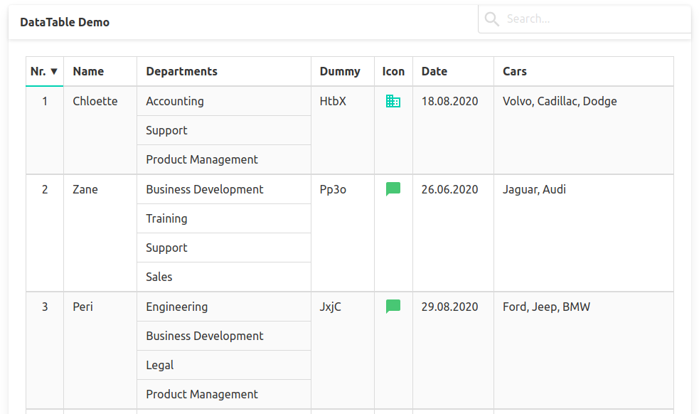

# buefy-datatable

Vue.js-based data table that supports custom fields, search, column filtering and merged rows.

Styled with buefy/bulma (can be adapted for other component frameworks).



```html
<DataTable
  title="DataTable Demo"
  :fields="tableFields"
  :data="tableData"
  fixed-height="220"
/>
```

### Properties

- `title` Title of the data table

- `fields` Table fields
  Specify as an array of TableField objects

  ```js
  fields: [
      new TableFieldTiny('Nr.'),
      new TableField('Name'),
      new TableField('Departments'),
      new TableFieldDummy('Dummy'),
      new TableFieldIcon('Icon', ICONS, true),
      new TableFieldDate('Date'),
      new TableFieldList('Cars'),
  ]
  ```

  

- `data` Table data

  The table data consists of an array of table items. Each item is an array of data item arrays.

  The structure looks like this

  ```js
  data: [ // Data object (table)
      [ // Table item (grouped table row)
          [ // Data item array (grouped table field)
              'Accounting', // Data item (single table field)
              'Support',
              'Product Management'
          ]
      ]
  ]
  ```

  Here is the data for the first 2 items of the example table:

  ```js
  data: [
      [
          [1],
          ['Chloette'],
          ['Accounting', 'Support', 'Product Management'],
          ['HtbX'],
          [0],
          ['18.08.2020'],
          [['Volvo', 'Cadillac', 'Dodge']],
      ],
      [
          [2],
          ['Zane'],
          ['Business Development', 'Training', 'Support', 'Sales'],
          ['Pp3o'],
          [1],
          ['26.06.2020'],
          [['Jaguar, Audi']],
      ],
  ]
  ```

  

